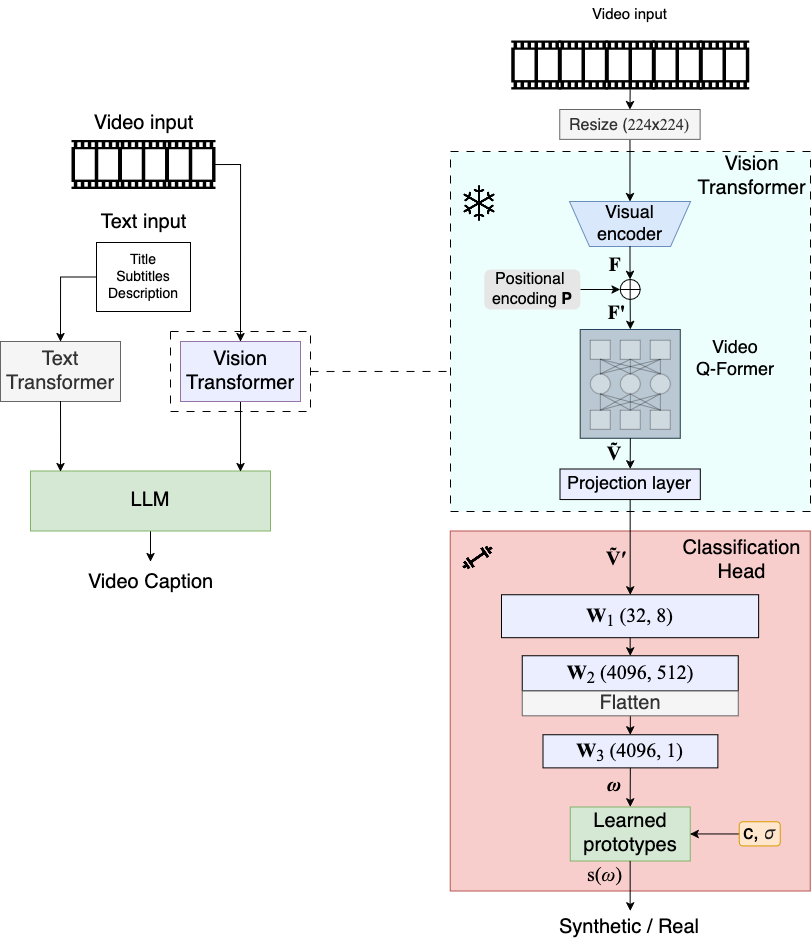
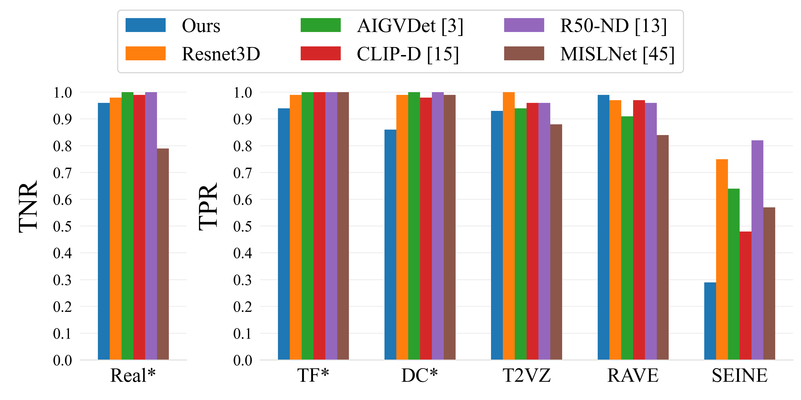
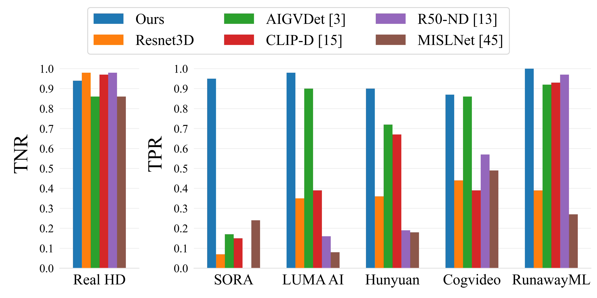
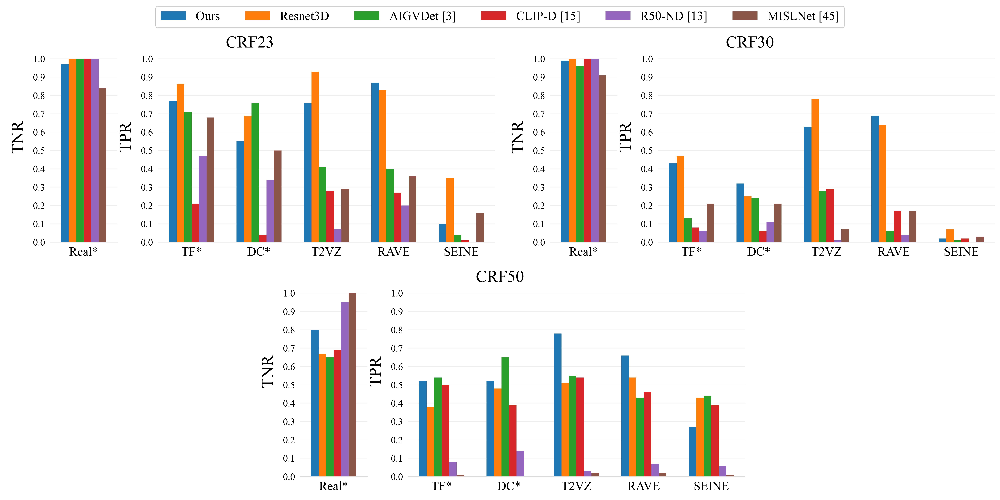
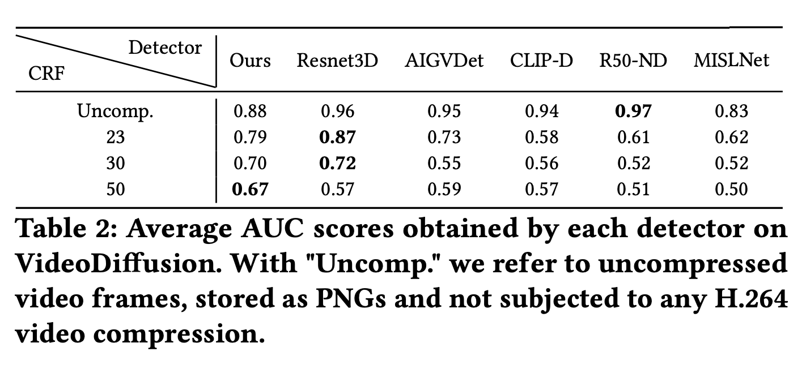
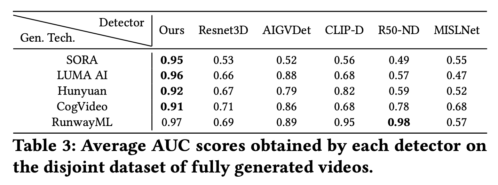

# TrueFake: A Real World Case Dataset of Last Generation Fake Images also Shared on Social Networks

This is the official code implementation of the "IH&MMSec 2025" paper ["Advance Fake Video Detection via Vision Transformers"](https://arxiv.org/abs/2504.20669)\
Authors: Joy Battocchio, Stefano Dell'Anna, Andrea Montibeller, Giulia Boato

## Abstract

<table>
<tbody>
<tr>
<td style="width:30%; vertical-align: top;"> Recent advancements in AI-based multimedia generation have enabled the creation of hyper-realistic images and videos, raising concerns about their potential use in spreading misinformation. The widespread accessibility of generative techniques, which allow for the production of fake multimedia from prompts or existing media, along with their continuous refinement, underscores the urgent need for highly accurate and generalizable AI-generated media detection methods, underlined also by new regulations like the European Digital AI Act. In this paper, we draw inspiration from Vision Transformer (ViT)-based fake image detection and extend this idea to video. We propose an {original} %innovative framework that effectively integrates ViT embeddings over time to enhance detection performance. Our method shows promising accuracy, generalization, and few-shot learning capabilities across a new, large and diverse dataset of videos generated using five open source generative techniques from the state-of-the-art, as well as a separate dataset containing videos produced by proprietary generative methods. </td>
<td style="width:70%; vertical-align: top;">  ⠀⠀⠀⠀⠀⠀⠀⠀⠀⠀⠀⠀⠀⠀⠀⠀⠀⠀⠀⠀⠀⠀⠀⠀⠀⠀⠀⠀⠀⠀⠀⠀⠀⠀⠀⠀</td>
</tr>
</tbody>
</table>

# Dataset
The dataset will be made available soon.

# Detectors
In this repository we provide the code for the two detectors proposed in the paper: 
* ```./Video-ViT/``` contains the code for Video Transformer Detector (VDT), which uses the pretrained video transformer of [Panda-70M](https://github.com/snap-research/Panda-70M) as a feature extactor for the detection task.
* ```./Resnet3D/``` contains the code for our Resnet3D detector, based on [SlowFast network](https://doi.org/10.1109/ICCV.2019.00630) and finetuned for the detection task.


> **Note:**\
> The networks here provided were trained according to the information provided in the paper on a limited subset of non-compressed data.\
> If you plan on using the networks for other purposes other than to replicate the results in the paper, you should re-train it on a more comprehensive subset.

## Set up Virtual-Env
```
conda env create -f environment.yml
```

## VDT
Manually download the video transformer weights as detailed in the [offical repo](https://github.com/snap-research/Panda-70M/tree/main/captioning#download-checkpoint) and put the file in ```./Video-ViT/ViT_panda/checkpoint```

### Train
You can train the model using:
```
python train.py --name RUN_NAME --device cuda:0 --model vit_panda --prototype --invert_labels --data_root DATA_ROOT --data_root_commercial DATA_ROOT_COMMERCIAL --batch_size 50 --num_threads 24 --n_frames 8 --dilation 1 --num_batches 5
```

To use the [pretrained weights](https://drive.usercontent.google.com/download?id=1w9MSmPQbZGM_mAnKNQYsk9iS9ysBIxj2&export=download), create the corresponding directory with ```mkdir -p ./Video-ViT/train/IHMMSec25/models/``` and move the file in it, make sure that it is named ```best.pt```

### Test
You can test the model using:
```
python test.py --name RUN_NAME --device cuda:0 --model vit_panda --prototype --invert_labels --data_root DATA_ROOT --data_root_commercial DATA_ROOT_COMMERCIAL --batch_size 50 --num_threads 24 --n_frames 8 --dilation 1 --num_batches 8
```

For the aforementioned pretrained weights, ```RUN_NAME = IHMMSec25```

## Resnet 3D
### Train
You can train the model using:
```
python train.py --name RUN_NAME --device cuda:0 --model slow_3d --prototype --invert_labels --data_root DATA_ROOT --data_root_commercial DATA_ROOT_COMMERCIAL --batch_size 12 --num_threads 24 --n_frames 8 --dilation 1 --num_batches 1
```

To use the [pretrained weights](https://drive.usercontent.google.com/download?id=1Df95AAQ37mJkzRivTRlQnz5xDlWsQiYK&export=download), create the corresponding directory with ```mkdir -p ./Resnet3D/train/IHMMSec25/models/``` and move the file in it, make sure that it is named ```best.pt```


### Test
You can test the model using:
```
python test.py --name RUN_NAME --device cuda:0 --model slow_3d --prototype --invert_labels --data_root DATA_ROOT --data_root_commercial DATA_ROOT_COMMERCIAL --batch_size 12 --num_threads 24 --n_frames 8 --dilation 1 --num_batches 8
```

For the aforementioned pretrained weights, ```RUN_NAME = IHMMSec25```

# Results
Check [Advance Fake Video Detection via Vision Transformers](https://arxiv.org/abs/2504.20669)

<table>
<tbody>
<tr>
<td style="width:50%; vertical-align: top; text-align:center">  </td>
<td style="width:50%; vertical-align: top; text-align:center">  </td>
</tr>
<tr>
<td style="width:100%; vertical-align: top; text-align:center" colspan="2">  </td>
</tr>
</tbody>
</table>

<table>
<tbody>
<tr>
<td style="width:50%; vertical-align: top; text-align:center">  </td>
<td style="width:50%; vertical-align: top; text-align:center">  </td>
</tr>
</tbody>
</table>

# Cite us
If you use this material please cite:

```
@misc{battocchio2025advancefakevideodetection,
      title={Advance Fake Video Detection via Vision Transformers}, 
      author={Joy Battocchio and Stefano Dell'Anna and Andrea Montibeller and Giulia Boato},
      year={2025},
      eprint={2504.20669},
      archivePrefix={arXiv},
      primaryClass={cs.CV},
      url={https://arxiv.org/abs/2504.20669}, 
}
```
